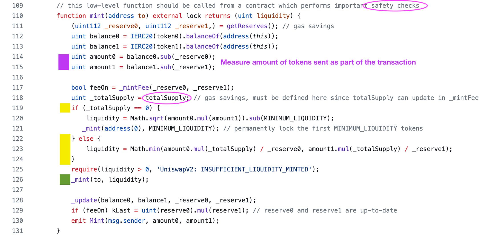
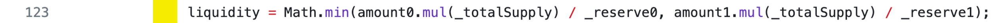

# 2024-Spring-HW2

Please complete the report problem below:

## Problem 1
Provide your profitable path, the amountIn, amountOut value for each swap, and your final reward (your tokenB balance).

> Solution
tokenB(2.9634677311990667) -> tokenA(3.886224926462967) -> tokenD(1.851933060966517) -> tokenC(4.010847553512431) -> tokenB(18.024373945692943) 
tokenB(1.781761649887093) -> tokenD(0.723227051858478) -> tokenC(1.2895953086398464) -> tokenB(2.492492386984466),
tokenB balance=5+(18.024373945692943-2.9634677311990667)+(2.492492386984466-1.781761649887093)=20.771636951591248

path: tokenB-> tokenA -> tokenD -> tokenC -> path: tokenB-> tokenD -> tokenC -> tokenB, tokenB balance=20.771636951591248

## Problem 2
What is slippage in AMM, and how does Uniswap V2 address this issue? Please illustrate with a function as an example.

> Solution
The slippage in AMM refers to the difference between the expected price of a trade and the price at which the trade is executed. Slippage occurs primarily due to price movement between the time a transaction is submitted and when it is executed. In AMMs like Uniswap, another significant source of slippage arises from the trade size relative to the liquidity in the pool.

Uniswap V2, like its predecessor, addresses slippage by:
1.Price Impact as a Function of Trade Size: Smaller trades relative to the pool size experience less slippage. Traders can estimate the impact of their trade size on the price and slippage using the pool's current state.

2.Providing Slippage Tolerance Settings: Traders can set their maximum acceptable slippage (e.g., 1%, 0.5%) in their transaction. If the actual slippage exceeds this tolerance due to price movement, the transaction will fail. This protects users from excessive unfavorable price movements.

3.Liquidity Provision: More liquidity in the pool reduces slippage as the ratio of assets changes less dramatically with each trade. Encouraging liquidity provision is thus central to reducing slippage.

for an example in Uniswap V2:
// SPDX-License-Identifier: MIT
pragma solidity ^0.8.0;

interface IUniswapV2Router {
    function swapExactETHForTokens(
        uint amountOutMin, 
        address[] calldata path, 
        address to, 
        uint deadline
    ) external payable returns (uint[] memory amounts);
}

contract MyTradingContract {
    address private constant UNISWAP_V2_ROUTER = 0x7a250d5630B4cF539739dF2C5dAcb4c659F2488D;
    address private constant WETH = 0xC02aaA39b223FE8D0A0e5C4F27eAD9083C756Cc2;
    address private constant DAI = 0x6B175474E89094C44Da98b954EedeAC495271d0F;

    function swapETHForAtLeastDAI(uint minDAI) external payable {
        address[] memory path = new address;
        path[0] = WETH;
        path[1] = DAI;

        uint deadline = block.timestamp + 300; // 5 minutes from the current block timestamp

        IUniswapV2Router(UNISWAP_V2_ROUTER).swapExactETHForTokens{value: msg.value}(
            minDAI,
            path,
            msg.sender, // Tokens are sent to the caller
            deadline
        );
    }
}
This function allows a user (or another contract) to call swapETHForAtLeastDAI, sending some ETH and specifying the minimum amount of DAI they are willing to accept. If the amount of DAI that can be bought with the given ETH at the current state of the Uniswap pool is below minDAI, the transaction will revert, thus avoiding unwanted slippage.

## Problem 3
Please examine the mint function in the UniswapV2Pair contract. Upon initial liquidity minting, a minimum liquidity is subtracted. What is the rationale behind this design?

> Solution

upon initial liquidity minting, a minimum
The mint function in the UniswapV2Pair contract deducts a minimum liquidity upon initial liquidity minting to prevent users from creating extremely small liquidity positions that could be manipulated easily. This deduction helps maintain a healthy liquidity pool and discourages potential attacks that could exploit small liquidity positions.

## Problem 4
Investigate the minting function in the UniswapV2Pair contract. When depositing tokens (not for the first time), liquidity can only be obtained using a specific formula. What is the intention behind this?

> Solution

Make sure the grant of liquidity token is fair, truly follow the liquidity inventor provided. 
Here's an counter example if the formula follow another rule,
If we took the maximum of the two ratios, someone could supply one additional token1 (at a cost of $100) and raise the pool value to $300. They’ve increase the pool value by 50%. However, under the maximum calculation, they would get minted 1 LP tokens, meaning they own 50% of the supply of the LP tokens, since the total circulating supply is now 2 LP tokens. Now they control 50% of the $300 pool (worth $150) by only depositing $100 of value. This is clearly stealing from other LP providers.

## Problem 5
What is a sandwich attack, and how might it impact you when initiating a swap?

> Solution

